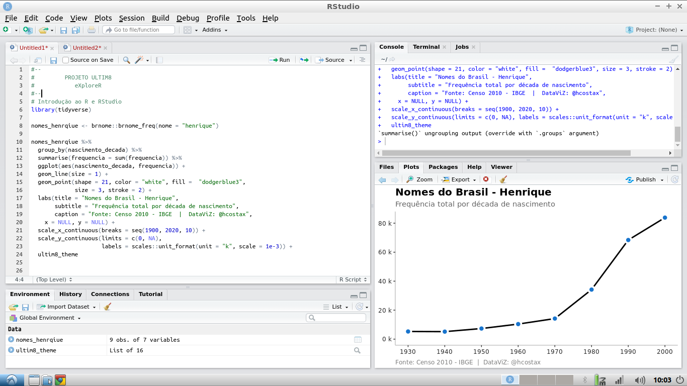

```{r setup, include = FALSE, cache = FALSE}
knitr::opts_chunk$set(error = TRUE, comment = NA, warnings = FALSE, errors = FALSE, messages = FALSE, tidy = FALSE)
```

```{r load-packages, include = FALSE}
library(tidyverse)
library(babynames)
```

> Atenção! Não deixe de colaborar com o passo 6, é importante para nós.

# Introdução

Este guia o guiará pelas etapas de instalação e uso do [R, um ambiente de software livre e de código aberto para computação e gráficos estatísticos.](https://www.r-project.org) 


O que é R?

* **R** é o nome da própria linguagem de programação, baseada em S do Bell Labs, que os usuários acessam através de um interpretador de linha de comando (`>`)


O que é o RStudio?

* **RStudio** é uma interface de usuário poderosa e conveniente que permite acessar a linguagem de programação R juntamente com muitos outros detalhes que melhoram a funcionalidade (e a sanidade). 


Nosso objetivo final é fazer com que você veja uma tela como esta:



# Agora vamos instalar o R e RStudio

Instale o R a partir do [CRAN](https://cran.rstudio.com). Por favor, escolha uma **distribuição binária pré-compilada** para o seu sistema operacional.

* Se você utiliza um sistema como Windows ou MacOS confira os vídeos tutoriais abaixo:
    - [Instalar o R e RStudio no MacOS](https://www.youtube.com/watch?v=rr54DqsJJjY)
    - [Instalando o R e RStudio no windows](https://www.youtube.com/watch?v=qKx4RAFPNuM&t=529s)

## Check in

O RStudio fornece uma poderosa interface de usuário para R, chamada *ambiente de desenvolvimento integrado* que vem da sigla em inglês IDE (*integrated development environment*). O RStudio inclui:

* um console (a interface de linha de comando padrão: `>`), 
* um editor de realce de sintaxe que oferece suporte à execução direta de código e
* ferramentas para plotagem, histórico, depuração e gerenciamento de espaço de trabalho.


Inicie o RStudio. Você deve obter uma janela semelhante à captura de tela semelhante ao que esta na seção de introdução, mas a sua estará vazia.


# Instalar pacotes

A versão do R que você acabou de baixar é considerada a base R, que fornece bons, mas básicos, recursos estatísticos de computação e gráficos. Para obter superpoderes analíticos e gráficos, você precisará instalar pacotes complementares, criados por usuários, para estender/expandir seus recursos do R. Os pacotes podem ser encontrados em dois lugares:

* Eles podem ser cuidadosamente selecionados pelo CRAN (que envolve um processo completo de envio e revisão) e, portanto, são fáceis de instalar utilizando o comando: `install.packages("nome_do_pacote", dependencies = TRUE)`. 

* Como alternativa, eles podem estar disponíveis via GitHub. Para baixar esses pacotes, primeiro você precisa instalar o pacote `devtools`.

```{r devtools, eval = FALSE}
install.packages("devtools")
library(devtools)
install_github("nome_do_pacote")
```

Coloque o cursor no console novamente, e assim você pode usar este método para instalar os seguintes pacotes diretamente do CRAN, todos os quais usaremos:

  * [`tidyverse`,](https://www.tidyverse.org/)

  * [`brnome`](https://github.com/italocegatta/brnome)

  
Você também pode fazer o download de todos eles de uma só vez:
```{r c_install, eval = FALSE}
install.packages("tidyverse", dependencies = TRUE)

devtools::install_github("italocegatta/brnome")

```

<p class="text-info"> __Atenção:__ Deveríamos introduzir formalmente o comando de combinação, [`c()`](http://stat.ethz.ch/R-manual/R-patched/library/base/html/c.html). Você usará isso com frequência - sempre que quiser combinar as coisas em um vetor. </p>

```{r c_demo}
c("olá", "meu", "nome", "é", "Henrique")
c(1:3, 20, 50)
```

Cuidado com o uso de citações com cuidado nos pacotes.

* Para *instalar* um pacote, coloque o nome do pacote entre aspas, como em `install.packages("nome_do_pacote")`.

* Para *usar* um pacote já instalado, você deve carregá-lo primeiro usando o comando `library(nome_do_pacote)`. Você só precisa fazer isso uma vez por sessão do RStudio.

* Se você quiser  *ajuda*, basta usar os comandos: `help(nome_do_pacote)` ou `?nome_do_pacote`.

* Se você deseja fazer a *citação* de um pacote (e deve dar crédito onde o crédito é devido), pergunte R como, utilizando o comando `citation("nome_do_pacote")`.


```{r show_dplyr, eval = F}
install.packages("tidyverse", dependencies = TRUE)
library(tidyverse)
help("tidyverse")
?tidyverse
```

```{r help_dplyr}
citation("tidyverse")
citation("ggplot2")
```


<p class="text-info"> __Atenção:__ o R faz **distinção entre maiúsculas e minúsculas**, portanto  `?tidyverse` funciona, mas `?Tidyverse` não irá funcionar. Da mesma forma, uma variável chamada `A` é diferente de `a`.</p>

# Fazendo um gráfico de nome

OAbra um novo script R no RStudio, acessando `File --> New File --> R Script`. Nesta primeira incursão no R, darei o código, então sente-se e relaxe e sinta-se livre para copiar e colar meu código.

Primeiro carregue os pacotes:

```{r show_name_packages, eval = F}
library(brnome)     # pacote que acessa a base de nomes do IBGE
library(tidyverse)   # conjunto de pacotes essenciais
```

A seguir, vamos buscar nomes na base de nomes do Brasil do Censo do IBGE através do pacote `brnome`.

```{r buscar_nome}

henrique <- brnome::brnome_freq(nome = "henrique")

```


A seguir, seguiremos alguns comandos para obter uma visão geral de alto nível (HLO) do seu conjunto de dados recém-lido em R. Vamos chamá-lo dizendo Olá para o seu conjunto de dados:

```{r hlo_dataset}
glimpse(henrique) # dplyr
head(henrique) # base R
tail(henrique) # same
names(henrique) # same
```


If you have done the above and produced sane-looking output, you are ready for the next bit. Use the code below to create a new data frame called `alison`.

```{r manipulate_name_data}
alison <- babynames %>%
  filter(name == "Alison" | name == "Allison") %>% 
  filter(sex == "F") 
```

* The first bit makes a new dataset called `alison` that is a copy of the `babynames` dataset- the `%>%` tells you we are doing some other stuff to it later.

* The second bit `filters` our `babynames` to only keep rows where the `name` is either Alison or Allison (read `|` as _"or"_.) 

* The third bit applies another `filter` to keep only those where sex is female.

Let's check out the data.

```{r}
alison
glimpse(alison)
```

Again, if you have sane-looking output here, move along to plotting the data!

```{r plot_name_data}
plot <- ggplot(alison, aes(x = year, 
                           y = prop,  
                           group = name, 
                           color = name)) + 
  geom_line()  
```

Now if you did this right, you will not see your plot! Because we saved the `ggplot` with a name (`plot`), R just saved the object for you. But check out the top right pane in RStudio again: under `Values` you should see `plot`, so it is there, you just have to ask for it. Here's how:

```{r}
plot 
```

# Make a new name plot

Edit my code above to create a new dataset. Pick 2 names to compare how popular they each are (these could be different spellings of your own name, like I did, but you can choose any 2 names that are present in the dataset). Make the new plot, changing the name of the first argument `alison` in `ggplot()` to the name of your new dataset.


## Save and share 

Save your work so you can share your favorite plot with us. You will not like the looks of your plot if you mouse over to `Export` and save it. Instead, use `ggplot2`'s command for saving a plot with sensible defaults:

```{r eval = FALSE}
help(ggsave)
```

```{r eval = F}
ggsave("alison_hill.pdf", plot) # please make the filename unique!
```

Upload this exported plot to Sakai before Wednesday at noon.

# Other cool `babynames` projects


- Julia Silge *'My Baby Boomer Name Might Have Been "Debbie"'*: https://juliasilge.com/blog/my-baby-boomer-name/
    - Use Julia's Shiny app: https://juliasilge.shinyapps.io/PredictNamesApp/


- Hilary Parker: Hilary: The Most Poisoned Baby Name in US History: https://hilaryparker.com/2013/01/30/hilary-the-most-poisoned-baby-name-in-us-history/


# Resources

- https://alison.rbind.io/html/jamboree_heart_ggplot.html

- http://moderndive.com/2-getting-started.html

- http://r4ds.had.co.nz

- https://www.rstudio.com/resources/cheatsheets/

- https://rweekly.org

